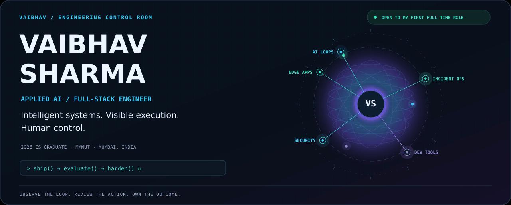
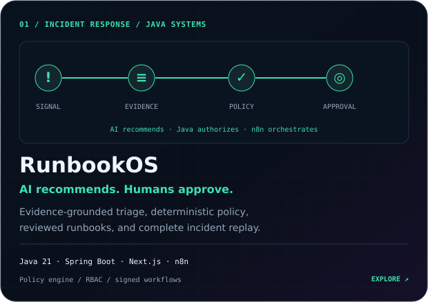
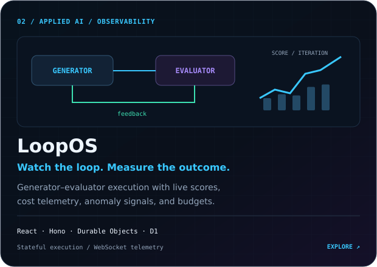
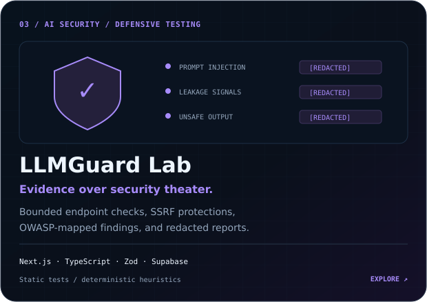
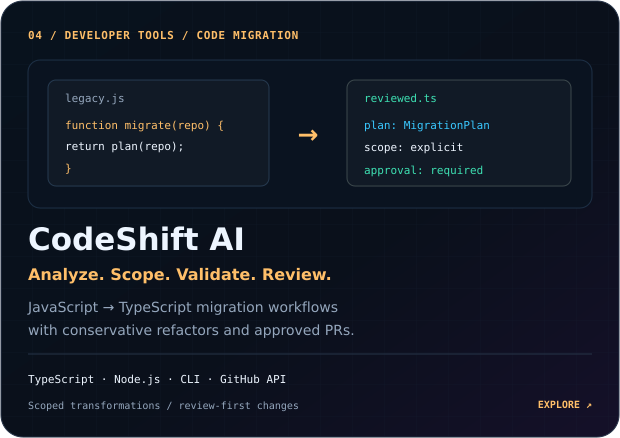
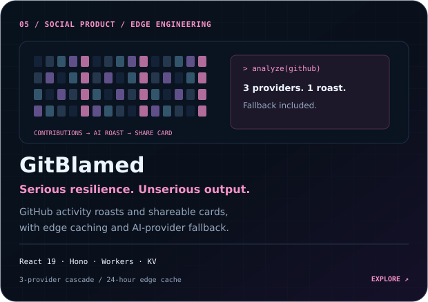
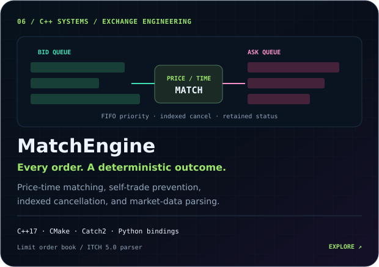
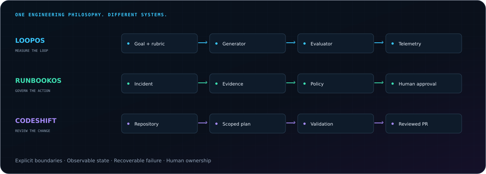
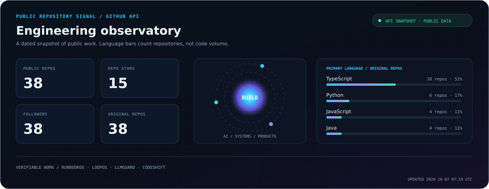

<!-- Commit this README together with assets/. See SETUP.md for installation. -->
<div align="center">

<a href="https://vaibhav7506portfolio.vercel.app/">
  
</a>

### I build the system around the model.

**Observable AI · Governed automation · Developer tools · Edge-native products**

[](https://vaibhav7506portfolio.vercel.app/)
[](https://www.linkedin.com/in/vaibhav-sharma-996aa8249/)
[](mailto:vs7977722@gmail.com)
[](https://leetcode.com/u/vaibhav7506/)

[**Start here**](#start-here) · [**Project gallery**](#project-gallery) · [**System blueprint**](#system-blueprint) · [**Stack**](#engineering-constellation) · [**Snake**](#contribution-snake) · [**Connect**](#connect)


</div>

---

## Start here

I'm **Vaibhav Sharma**, a **2026 B.Tech Computer Science graduate from MMMUT Gorakhpur**, based in **Mumbai, India**. I build production-focused LLM applications, agentic workflows, evaluation systems, secure AI infrastructure, and full-stack products. I like systems that expose what happened, why it happened, and where a human needs to decide.

**Open to my first full-time role:** Applied AI Engineer, SDE, Full-Stack, Backend, or Frontend Developer.

| If you want to see… | Start with | What to inspect |
|:---|:---|:---|
| **Java backend & incident automation** | [RunbookOS demo ↗](https://runbookos-ten.vercel.app) | Incident evidence → policy decisions → human approval → audit replay |
| **Applied AI & stateful infrastructure** | [LoopOS demo ↗](https://loopos-web.pages.dev/) | Goal and rubric → generator–evaluator loop → score, cost, and anomaly telemetry |
| **Developer tooling & careful automation** | [CodeShift AI demo ↗](https://codeshift-ai-web.vercel.app) | Repository analysis → scoped migration plan → validation → reviewed PR |
| **Full-stack product personality** | [GitBlamed demo ↗](https://git-blamed-web.vercel.app) | Contribution heatmap → AI roast → downloadable share card |

## Project gallery

**Six featured projects. Six different engineering problems.** Open the live demos, or inspect MatchEngine’s source, benchmarks, and market-data parser.

<table>
<tr>
<td width="50%" valign="top" align="center">
<a href="https://runbookos-ten.vercel.app"></a>
<a href="https://runbookos-ten.vercel.app"><b>Launch demo ↗</b></a> · <a href="https://github.com/vaibhav7506/Runbookos">Read the source</a>
</td>
<td width="50%" valign="top" align="center">
<a href="https://loopos-web.pages.dev/"></a>
<a href="https://loopos-web.pages.dev/"><b>Launch demo ↗</b></a> · <a href="https://github.com/vaibhav7506/LoopOS">Read the source</a>
</td>
</tr>
<tr>
<td width="50%" valign="top" align="center">
<a href="https://llmguardweb.vercel.app/"></a>
<a href="https://llmguardweb.vercel.app/"><b>Launch demo ↗</b></a> · <a href="https://github.com/vaibhav7506/LLMGuard">Read the source</a>
</td>
<td width="50%" valign="top" align="center">
<a href="https://codeshift-ai-web.vercel.app"></a>
<a href="https://codeshift-ai-web.vercel.app"><b>Launch demo ↗</b></a> · <a href="https://github.com/vaibhav7506/codeshift-ai">Read the source</a>
</td>
</tr>
<tr>
<td width="50%" valign="top" align="center">
<a href="https://git-blamed-web.vercel.app/"></a>
<a href="https://git-blamed-web.vercel.app/"><b>Launch demo ↗</b></a> · <a href="https://github.com/vaibhav7506/GitBlamed">Read the source</a>
</td>
<td width="50%" valign="top" align="center">
<a href="https://github.com/vaibhav7506/MatchEngine"></a>
<a href="https://github.com/vaibhav7506/MatchEngine"><b>Explore the engine ↗</b></a> · <a href="https://github.com/vaibhav7506/MatchEngine/blob/main/docs/itch/README.md">Market-data parser</a>
</td>
</tr>
</table>

### Explore more disciplines

| Project | Discipline | Engineering detail | Explore |
|:---|:---|:---|:---|
| **ExamForge** | EdTech / edge-native products | Adaptive MCQs, timed mock tests, past papers, and progress tracking | [Demo](https://examforge.vaibhav7506.workers.dev/) · [Source](https://github.com/vaibhav7506/ILovePadhai) |
| **ResuMatch** | Agentic RAG / Python APIs | FastAPI + LangGraph + pgvector; PII redaction, explainable matching, streamed node progress | [Demo](https://resumatchvaibhav7506.up.railway.app/) · [Source](https://github.com/vaibhav7506/Resumatch) |
| **Weave** | Distributed systems / collaboration | Hand-built CRDT, Java/TypeScript implementations, durable WebSocket sync, convergence and network-chaos checks | [Source](https://github.com/vaibhav7506/weave) |
| **Sentinel** | Infrastructure / ML telemetry | Host telemetry, forecasting, incident evidence, and documented prediction limitations | [Source](https://github.com/vaibhav7506/SENTINEL) |
| **Multi-App Automation** | Workflow products / integrations | Drag-and-drop workflows with reusable components, conditions, and 15+ service integrations | [Demo](https://zapier-project.vercel.app) · [Source](https://github.com/vaibhav7506/zapier-project) |
| **TracePilot QA** | Browser automation / testing | Durable browser traces, evidence-backed findings, and exported Playwright regression tests | [Source](https://github.com/vaibhav7506/TracePilot) |

<details>
<summary><b>Open the technical dossiers — architecture, execution limits, and project details</b></summary>

<details>
<summary><b>RunbookOS — Human-Governed AI Incident Response</b></summary>

| Area | Implementation |
|:---|:---|
| **Control plane** | Java 21, Spring Boot, incident/execution state machines, tenant isolation, backend-enforced RBAC |
| **Interface & orchestration** | Next.js workspace, REST/SSE, bounded n8n workflows, signed callbacks and scoped execution tokens |
| **AI boundaries** | Evidence-linked analysis, citations, budgets, provider fallback, prompt-injection defenses, credential-free Demo Mode |
| **Governance** | Versioned runbooks, deterministic risk policy, human approvals, elevated two-person review, prohibited-action denial |
| **Reliability** | Transactional outbox, idempotency, retries, circuit breakers, bulkheads, dead letters, and redrive |
| **Audit & operations** | Hash-chained events, incident replay, Prometheus, OpenTelemetry, Grafana, Docker, and GitHub Actions |

**AI recommends. Java authorizes. Humans approve. n8n orchestrates.** A portfolio-grade reference implementation that demonstrates governed incident automation through a credential-free demo.

[Demo](https://runbookos-ten.vercel.app) · [Source and architecture](https://github.com/vaibhav7506/Runbookos)

</details>

<details>
<summary><b>LoopOS — Observable Generator-Evaluator AI Platform</b></summary>
<br/>

| | |
|---|---|
| **Stack** | React, TypeScript, Hono, Cloudflare Workers, Durable Objects, D1, AI Gateway |
| **Scale** | Real-time WebSocket telemetry, alarm-based stateful loop execution |
| **Impact** | Deterministic scoring, cost tracking, anomaly monitoring, explicit termination states |

An observability-first platform for generator-evaluator AI loops with configurable goals, weighted rubrics, iteration limits, and budget controls — engineered without relying on long-running HTTP requests.

[`Repo`](https://github.com/vaibhav7506/LoopOS) · [`Live Demo`](https://loopos-web.pages.dev/)

</details>

<details>
<summary><b>LLMGuard Lab — Defensive LLM Endpoint Security Scanner</b></summary>
<br/>

| | |
|---|---|
| **Stack** | Next.js, React, TypeScript, Zod, Recharts, Supabase |
| **Scale** | 12-test execution limit, 8s per-request timeout, bounded concurrency |
| **Impact** | OWASP-mapped findings with severity, confidence, redacted evidence, JSON/Markdown reports |

An authorized black-box security scanner for LLM endpoints using safe static test cases and deterministic heuristic analysis — no external LLM judge, with SSRF protection for localhost/private/link-local networks.

[`Repo`](https://github.com/vaibhav7506/LLMGuard) · [`Live Demo`](https://llmguardweb.vercel.app/)

</details>

<details>
<summary><b>TracePilot QA — Browser QA &amp; Regression-Test Generation</b></summary>

| | |
|---|---|
| **Stack** | Next.js 15, React, TypeScript, PostgreSQL, Prisma, Playwright, Three.js, GSAP |
| **Execution** | Same-domain, time-bounded and step-bounded browser journeys with durable traces |
| **Output** | Evidence-backed findings and exportable Playwright regression tests |
| **AI layer** | Optional OpenAI, Groq, Anthropic, and Gemini gateway with encrypted BYOK credentials |

Captures browser steps, console errors, network failures, and screenshots. Deterministic findings and test generation remain available without AI; Three.js supports the landing-page route visualization.

[Source code](https://github.com/vaibhav7506/TracePilot)

</details>

<details>
<summary><b>MatchEngine — C++17 Order Matching &amp; Market-Data Parsing</b></summary>

| Area | Implementation |
|:---|:---|
| **Core engine** | Standalone C++17 limit order book with price-time priority and self-trade prevention |
| **Order lifecycle** | Indexed cancellation/replacement, retained statuses, and cached top-of-book/depth snapshots |
| **Market data** | Independent Nasdaq ITCH 5.0 parser; documented full-session parsing and lifecycle reconciliation |
| **Optional Python layer** | Historical replay, two strategies, and execution-based accounting through bindings |
| **Verification** | Catch2 tests, measured benchmarks, and sanitizer checks documented in the repository |

The core is single-threaded and uses the C++ standard library. The exchange gateway, risk, and full-integration roadmap stages are future work.

[Source and benchmarks](https://github.com/vaibhav7506/MatchEngine) · [ITCH parser documentation](https://github.com/vaibhav7506/MatchEngine/blob/main/docs/itch/README.md)

</details>

<details>
<summary><b>ExamForge — AI-Powered Exam Prep Platform</b></summary>
<br/>

| | |
|---|---|
| **Stack** | React 19, Vite, Hono, Cloudflare D1/KV/R2, Groq, Drizzle ORM |
| **Scale** | Fully deployed on Cloudflare's edge stack |
| **Impact** | Groq-powered generation with Drizzle-managed schema at the edge |

An exam-prep platform running entirely on Cloudflare's edge stack (D1, KV, R2) with Groq-powered content generation.

[`Repo`](https://github.com/vaibhav7506/ILovePadhai) · [`Live Demo`](https://examforge.vaibhav7506.workers.dev/)

</details>

<details>
<summary><b>CodeShift AI — Review-First AI-Assisted Migration Platform</b></summary>
<br/>

| | |
|---|---|
| **Stack** | TypeScript, Node.js, Next.js, GitHub API, CLI, BYOK AI, Monorepo |
| **Scale** | Repo analysis → readiness scoring → scoped migration plans |
| **Impact** | Human-approved GitHub PR generation, zero unauthorized Git mutations |

A JS-to-TypeScript migration platform with CLI workflows for analysis, planning, transformation, and validation. The optional BYOK AI layer explains migrations without expanding scope or bypassing approval gates.

[`Repo`](https://github.com/vaibhav7506/codeshift-ai) · [`Live Demo`](https://codeshift-ai-web.vercel.app)

</details>

<details>
<summary><b>GitBlamed — GitHub Activity Analysis & AI Roast Generator (2024–2025)</b></summary>
<br/>

| | |
|---|---|
| **Stack** | React 19, Vite, Hono, Cloudflare Workers, Workers KV |
| **Scale** | 24-hour edge caching, 3-provider fallback chain (Groq → Gemini → Anthropic) |
| **Impact** | Dynamic Open Graph social cards via Satori, deterministic local fallback |

A responsive React 19 interface with contribution heatmaps, typewriter interactions, and downloadable shareable cards — resilient to provider outages by design.

[`Repo`](https://github.com/vaibhav7506/GitBlamed) · [`Live Demo`](https://git-blamed-web.vercel.app)

</details>

<details>
<summary><b>Multi-App Automation Platform — Zapier-style Workflow Builder (2024)</b></summary>
<br/>

| | |
|---|---|
| **Stack** | React, Node.js, Express.js, MongoDB, REST APIs |
| **Scale** | 15+ external service integrations (Gmail, Slack, Sheets, Twitter, Stripe) |
| **Impact** | Drag-and-drop workflow builder with reusable, conditionally-configured components |

A workflow automation platform letting users connect external services and build multi-step automations with configurable triggers and actions.

[`Repo`](https://github.com/vaibhav7506/zapier-project) · [`Live Demo`](https://zapier-project.vercel.app)

</details>

</details>

## System blueprint



| Design question | How I approach it | Where to inspect it |
|:---|:---|:---|
| **Can we explain what the system did?** | Record scores, evidence, traces, and audit events | LoopOS · RunbookOS · TracePilot |
| **Who decides whether an action is allowed?** | Deterministic policy and human approval at action boundaries | RunbookOS · CodeShift AI |
| **What happens when execution stalls or providers fail?** | Durable state, continuation, bounded retries, and fallback | LoopOS · GitBlamed · RunbookOS |
| **Can a result be reviewed without trusting an opaque model call?** | Explicit rubrics, heuristic findings, scoped diffs, and validation | LoopOS · LLMGuard · CodeShift AI |

## Engineering constellation

<table>
<tr>
<td width="33%" valign="top" align="center">
<br/>
<h3>Intelligence</h3>
LLM integration &amp; structured outputs<br/>
Generator–evaluator loops<br/>
Agentic RAG and prompt engineering<br/>
AI evaluation and anomaly signals
</td>
<td width="33%" valign="top" align="center">
<br/>
<h3>Platforms</h3>
Java / Spring Boot control planes<br/>
React / Next.js full-stack products<br/>
Node.js APIs and workflow automation<br/>
Real-time state and collaboration
</td>
<td width="33%" valign="top" align="center">
<br/>
<h3>Reliability</h3>
Edge execution and durable state<br/>
Security boundaries and redaction<br/>
Provider fallback and observability<br/>
Approval gates and audit trails
</td>
</tr>
</table>

<details open>
<summary><b>Full technology loadout</b></summary>

**Languages**


**Frontend**


**Backend & Runtime**


**Databases**


**Tools & Platforms**


---

### Focus areas


-0D1117?style=for-the-badge&color=A78BFA&labelColor=0D1117)


---


</details>

## Project experience

<details>
<summary><b>View the project timeline</b></summary>

Project-based engineering experience; currently seeking my first full-time position.

**RunbookOS — incident automation**
- Built a Java/Spring Boot control plane with explicit state machines, deterministic policy, and approval flows
- Designed evidence-linked analysis, signed orchestration boundaries, and replayable audit events
- `Java` `Spring Boot` `Next.js` `n8n`

**`[2026]` CodeShift AI**
- Built repo analysis engine calculating migration readiness and recommending scoped targets
- Developed CLI workflows for transformation, validation, and GitHub PR creation with human approval gates
- `TypeScript` `Node.js` `GitHub API` `CLI`

**`[2025–2026]` LoopOS**
- Engineered stateful AI loop execution using Cloudflare Durable Objects and alarm-based processing
- Implemented deterministic scoring, token/cost tracking, and anomaly monitoring
- `React` `Hono` `Cloudflare Workers` `Durable Objects`

**`[2025–2026]` LLMGuard Lab**
- Built an OWASP LLM Top 10-mapped black-box security scanner with SSRF protections
- Generated severity-scored, redacted-evidence reports with export support
- `Next.js` `TypeScript` `Zod` `Supabase`

**`[2024–2025]` GitBlamed**
- Architected a Cloudflare Workers backend with 24h KV caching and a 3-provider AI fallback chain
- Built dynamic OG social cards via Satori
- `React 19` `Hono` `Workers KV`

**`[2024]` Multi-App Automation Platform**
- Built a Zapier-style drag-and-drop workflow builder with 15+ service integrations
- `React` `Node.js` `Express` `MongoDB`

---


</details>

## Education & achievements

<div align="center">

| Achievement | Detail |
|:---|:---|
| Problem solving | 380+ problems solved (Java) — [View Profile](https://leetcode.com/u/vaibhav7506/) |
| Certified: Java | Programming Using Java — Infosys |
| Certified: Backend APIs | Backend REST API with Node.js — Udemy |
| Certified: NoSQL | NoSQL — Infosys |

</div>

---

### Education

<div align="center">

-0C1725?style=for-the-badge&color=39C8FF&labelColor=0C1725)

</div>

---


## Engineering observatory



*Repository counts come from the public GitHub API; language percentages count original repositories with a primary language. The timestamp records the snapshot, and the included workflow refreshes it daily.*

<div align="center">


</div>

## Contribution snake

**Keep the commits moving.** My contribution graph, eaten one square at a time.

<picture>
  <source media="(prefers-color-scheme: dark)" srcset="https://raw.githubusercontent.com/vaibhav7506/vaibhav7506/output/github-contribution-grid-snake-dark.svg" />
  <source media="(prefers-color-scheme: light)" srcset="https://raw.githubusercontent.com/vaibhav7506/vaibhav7506/output/github-contribution-grid-snake.svg" />
  
</picture>

<!-- Existing .github/workflows/snake.yml remains unchanged and publishes to output. -->

### Activity stream


<details>
<summary><b>Open trophies, language cards, and the full GitHub diagnostic</b></summary>

### Trophy case


<div align="center">


</div>

### Additional activity view

<div align="center">


</div>

### Full Diagnostic

<div align="center">


</div>


</details>

## Current build log

| Building | Learning & deepening | Exploring |
|:---|:---|:---|
| **Sentinel:** infrastructure telemetry, forecasting, and incident evidence with recorded ML limitations | **Java / Spring Boot:** policy, state machines, resilience, and secure orchestration | **Multi-agent design:** explicit execution boundaries and evaluation infrastructure |
| **Applied AI and developer tools:** inspectable workflows and human-reviewed actions | **ML fundamentals:** honest evaluation, measurable outcomes, and failure analysis | **Distributed systems:** durable state, collaboration, recovery, and observability |

<details>
<summary><b>⌘ Open the engineering terminal</b></summary>

```yaml
$ cat engineer.yaml
name: Vaibhav Sharma
class: Applied AI / Full-Stack Engineer
education: B.Tech CSE · MMMUT Gorakhpur · 2022–2026
base: Mumbai, India
experience: project-based · seeking first full-time role
principles:
  - show the evidence
  - bound the execution
  - keep humans in control
  - make failures recoverable
quests:
  - Applied AI Engineer
  - Software Development Engineer
  - Full-Stack / Backend / Frontend Developer
```

**Pick a mission:** [Triage an incident](https://runbookos-ten.vercel.app) · [Observe an AI loop](https://loopos-web.pages.dev/) · [Plan a migration](https://codeshift-ai-web.vercel.app) · [Roast your GitHub](https://git-blamed-web.vercel.app)

</details>

---

<div align="center">

<h2 id="connect">Build beyond the model.</h2>

**Intelligence becomes useful when the surrounding system is dependable.**

I'm looking for my first full-time engineering role and teams building thoughtful AI systems, developer tools, or full-stack products.

[](mailto:vs7977722@gmail.com)

**[Portfolio](https://vaibhav7506portfolio.vercel.app/) · [LinkedIn](https://www.linkedin.com/in/vaibhav-sharma-996aa8249/) · [All repositories](https://github.com/vaibhav7506?tab=repositories) · [LeetCode](https://leetcode.com/u/vaibhav7506/)**

*“Ship it, evaluate it, harden it — then ship again.”*

Strong Beliver of "Karne Walo Ka kuch Na kuch Ho hi Jaata Hai"


</div>
